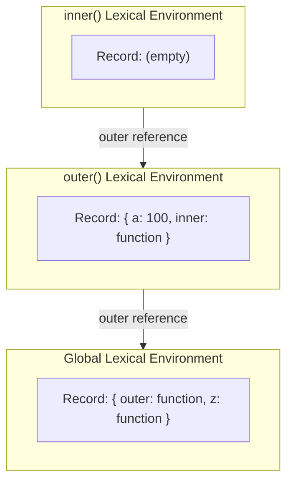

# Frontend Interview Questions & Answers

## Table of Contents

Priority: ⭐⭐⭐ = must-know / asked very often · ⭐⭐ = commonly asked · ⭐ = good to know / asked less often

| No. | Priority | Topic                    | Question                                                    |
| :-: | :-: | ------------------------ | ------------------------------------------------------------ |
|  1  | ⭐⭐⭐ | JS Runtime & Event Loop | [How does JavaScript work?](#how-does-javascript-work)       |
|  2  | ⭐⭐⭐ | Hoisting              | [What is Hoisting?](#what-is-hoisting)       |
|  3  | ⭐⭐ | Hoisting              | [Are let and const hoisted?](#are-let-and-const-hoisted)       |
|  4  | ⭐⭐ | Hoisting              | [What is Temporal Dead Zone (TDZ)?](#what-is-temporal-dead-zone-tdz)       |
|  5  | ⭐⭐⭐ | Scope              | [What is scope and what are the different types of scope in JS?](#what-is-scope-and-what-are-the-different-type-of-scope-in-javascript)       |
|  6  | ⭐⭐⭐ | var, let, const              | [Difference between var, let, const?](#difference-between-var-let-const)       |
|  7  | ⭐⭐⭐ | Closures              | [What is Closure?](#what-is-closure)       |
|  8  | ⭐⭐ | Closures              | [What is Lexical Environment?](#what-is-lexical-environment)       |
|  9  | ⭐⭐⭐ | Closures              | [SetTimeout with closure?](#settimeout-with-closure)       |
| 10  | ⭐⭐ | Closures              | [What are the uses of closure?](#what-are-the-uses-of-closure)       |
| 11  | ⭐⭐ | Promises              | [What is Callback Hell?](#what-is-callback-hell)       |
| 12  | ⭐⭐⭐ | Promises              | [What are Promises?](#what-are-promises)       |
| 13  | ⭐⭐ | Promises              | [What is the Promise API? (all, allSettled, race, any)](#what-is-the-promise-api-all-allsettled-race-any)       |
| 14  | ⭐⭐ | Callbacks              | [What is a Callback Function?](#what-is-a-callback-function)       |
| 15  | ⭐⭐ | Functions              | [What is a First Class Function?](#what-is-a-first-class-function)       |
| 16  | ⭐⭐ | Functions              | [What are the different types of functions in JS?](#what-are-the-different-types-of-functions-in-js)       |
| 17  | ⭐⭐ | Functions              | [Function Declaration vs Function Expression?](#function-declaration-vs-function-expression)       |
| 18  | ⭐⭐⭐ | Async/Await              | [What is Async/Await?](#what-is-asyncawait)       |
| 19  | ⭐⭐ | Arrays              | [What are Array Methods?](#what-are-array-methods)       |
| 20  | ⭐⭐⭐ | Arrays              | [What are map, filter, reduce, and forEach?](#what-are-map-filter-reduce-and-foreach)       |
| 21  | ⭐⭐ | Operators              | [What is typeof?](#what-is-typeof)       |
| 22  | ⭐⭐ | Data Types              | [What are the Data Types in JS?](#what-are-the-data-types-in-js)       |
| 23  | ⭐ | Data Types              | [Undefined vs Not Defined?](#undefined-vs-not-defined)       |
| 24  | ⭐⭐ | Data Types              | [Null vs Undefined?](#null-vs-undefined)       |
| 25  | ⭐⭐⭐ | JS Runtime & Event Loop | [What is the Microtask Queue?](#what-is-the-microtask-queue)       |
| 26  | ⭐⭐ | DOM Events | [Event Bubbling vs Event Capturing?](#event-bubbling-vs-event-capturing)       |
| 27  | ⭐⭐⭐ | DOM Events | [What is Event Delegation?](#what-is-event-delegation)       |
| 28  | ⭐⭐⭐ | Performance | [What is Debounce?](#what-is-debounce)       |
| 29  | ⭐⭐⭐ | Performance | [What is Throttle?](#what-is-throttle)       |
| 30  | ⭐⭐⭐ | this Keyword | [What is the `this` Keyword?](#what-is-the-this-keyword)       |
| 31  | ⭐⭐⭐ | this Keyword | [What are call, apply, and bind?](#what-are-call-apply-and-bind)       |
| 32  | ⭐⭐ | Functions | [What is Currying?](#what-is-currying)       |
| 33  | ⭐⭐⭐ | Prototype | [What is a Prototype?](#what-is-a-prototype)       |
| 34  | ⭐⭐⭐ | Prototype | [What is the Prototype Chain?](#what-is-the-prototype-chain)       |
| 35  | ⭐⭐ | Prototype | [Difference between `__proto__` and `prototype`?](#difference-between-__proto__-and-prototype)       |
| 36  | ⭐⭐ | Prototype | [What is Prototypal Inheritance?](#what-is-prototypal-inheritance)       |
| 37  | ⭐⭐⭐ | Objects | [What is an Object?](#what-is-an-object)       |
| 38  | ⭐⭐ | Objects | [What are the different ways to create an Object in JS?](#what-are-the-different-ways-to-create-an-object-in-js)       |
| 39  | ⭐⭐⭐ | Objects | [What are Object Methods?](#what-are-object-methods)       |

### How does JavaScript work?

1. When JavaScript starts executing, a **Global Execution Context** is created and pushed onto the call stack. Execution context creation happens in two phases:
   - **Memory allocation phase** — variables and function declarations are hoisted and allocated memory.
   - **Code execution phase** — code runs line by line, assigning values.

2. When JS invokes a new function, a new execution context is created and pushed onto the call stack. Once that context finishes executing, control returns to the previous execution context, and the finished context is popped off the call stack.

3. When JS encounters an async task (e.g. `fetch`, `setTimeout`, DOM events), it delegates that task to the browser's Web API and moves on to the next line of code instead of waiting.

4. When the browser's Web API finishes the task, its callback is pushed into a task queue (or the microtask queue for promises). The **event loop** continuously checks whether the call stack is empty — once it is, it pushes the next callback from the queue onto the call stack for execution.

**[⬆ Back to Top](#table-of-contents)**

### What is Hoisting?

Execution context creation happens in two phases. Before code execution starts, the memory allocation phase completes — this is why we can use variables and functions before their declaration. This concept in JS is known as **hoisting**.

During memory allocation:
- Variables declared with `var` are stored in memory and initialized with `undefined`.
- Entire function declarations are stored in memory as-is (fully callable before their line runs).

**[⬆ Back to Top](#table-of-contents)**

### Are let and const hoisted?

Yes — `let` and `const` are hoisted, but into the **Temporal Dead Zone (TDZ)** rather than being initialized with `undefined`. Their memory is allocated in a separate space from `var` variables, and accessing them before their declaration line throws a `ReferenceError`. We can only use them after a value has been assigned to them.

**[⬆ Back to Top](#table-of-contents)**

### What is Temporal Dead Zone (TDZ)?

The Temporal Dead Zone is the time span between when a `let`/`const` variable's memory is allocated (at the start of its scope) and when it is actually assigned a value on its declaration line.

Accessing the variable anywhere in this span throws a `ReferenceError`.

**[⬆ Back to Top](#table-of-contents)**

### What is scope and what are the different type of scope in javascript?

Scope is the area of code where a variable or function can be accessed. Outside that area, it can't be accessed.

There are three types of scope in JavaScript:
1. Global scope
2. Function scope
3. Block scope

`var` has function scope, while `let` and `const` have block-level scope.

**[⬆ Back to Top](#table-of-contents)**

### Difference between var, let, const?

A variable declared with `var` can be redeclared and reassigned.
```js
var a = 10;
var a = 90; // redeclare — allowed
a = 30;     // reassign — allowed
```

A variable declared with `let` can be reassigned, but not redeclared.
```js
let b = 100;
let b = 900; // ❌ SyntaxError — redeclaration not allowed
b = 90;      // ✅ reassign — allowed
```

A variable declared with `const` cannot be redeclared or reassigned.
```js
const c = 100;
const c = 200; // ❌ SyntaxError — redeclaration not allowed
c = 300;       // ❌ TypeError — assignment to constant variable
```

In short: `var` has function scope; `let` and `const` have block scope.

**[⬆ Back to Top](#table-of-contents)**

### What is Closure?

A function along with its lexical scope is known as closure. Because of closure, an inner function can use its outer function's value.

```js
function outer() {
  var a = 100;

  return function inner() {
    console.log(a);
  };
}

var z = outer(); // outer() has already returned...
z();              // ...but inner() still remembers `a` → logs 100
```

**[⬆ Back to Top](#table-of-contents)**

### What is Lexical Environment?

A **lexical environment** is the local memory of the current scope (its variables/functions) *plus* a reference to the lexical environment of its parent scope. This chain of "current scope → parent scope → parent's parent scope → ... → global scope" is called the **scope chain**, and it's what a closure actually holds on to.

Using the `outer`/`inner` example above:



When `inner()` runs `console.log(a)`, it doesn't find `a` in its own environment, so it follows the **outer reference** to `outer()`'s lexical environment, finds `a = 100` there, and uses it — that's the scope chain in action.

**[⬆ Back to Top](#table-of-contents)**

### SetTimeout with closure?

```js
for (var i = 1; i <= 5; i++) {
  setTimeout(() => console.log(i), 1000);
}
// output -> 6,6,6,6,6
```

Here `setTimeout`'s callback creates a closure over the outer `for` loop's `i`. Since `var` has no block scope, there's only **one** `i` shared across all 5 iterations — by the time the callbacks run, the loop has already finished and `i` is `6`.

```js
for (let i = 1; i <= 5; i++) {
  setTimeout(() => console.log(i), 1000);
}
// output -> 1,2,3,4,5
```

With `let`, each iteration gets its **own block-scoped copy** of `i`, so each closure captures a different value.

```js
for (var i = 1; i <= 5; i++) {
  function inner(i) {
    setTimeout(() => console.log(i), 1000);
  }
  inner(i);
}
// output -> 1,2,3,4,5
```

Even with `var`, calling `inner(i)` on each iteration creates a **new function scope** with its own `i` parameter — so each closure again captures a different value, same result as the `let` version.

**[⬆ Back to Top](#table-of-contents)**

### What are the uses of closure?

- **Data privacy / encapsulation** — create private variables that can't be accessed directly from outside, only through returned functions.
- **Currying / partial application** — pre-fill some arguments of a function and return a new function for the rest.
- **Maintaining state in callbacks** — event handlers, `setTimeout`/`setInterval` callbacks, and async code can remember values from where they were created.
- **Memoization** — cache expensive function results using a variable held in closure.
- **The module pattern** — expose only a public API while keeping internal state hidden inside the closure.
- **Function factories** — generate specialized functions on the fly, e.g. `once()` helpers that run only the first time they're called.

```js
// data privacy example
function createCounter() {
  let count = 0; // private — not accessible from outside
  return {
    increment: () => ++count,
    getCount: () => count,
  };
}

const counter = createCounter();
counter.increment();
counter.increment();
console.log(counter.getCount()); // 2
```

**[⬆ Back to Top](#table-of-contents)**

### What is Callback Hell?

Callback hell happens when multiple async tasks are handled by nested callbacks. It makes code hard to debug and maintain, and makes error handling complex.

**[⬆ Back to Top](#table-of-contents)**

### What are Promises?

- Promises are used to handle async tasks.
- Promises are a JS object which represent the eventual completion or failure of an async task.
- Promises are used to avoid callback hell and inversion of control.
- Promises have 3 states: pending, fulfilled, rejected.
- Promises are created by the Promise constructor, which takes a single function as an argument, which further takes two arguments — `resolve` and `reject`. If everything goes well, we call the `resolve` method; if any error happens, we call `reject`.

```js
var promise = new Promise((resolve, reject) => {
  setTimeout(() => {
    resolve("promise resolved");
  }, 3000);
});
```

We have the promise's `.then` method to handle success and error scenarios. It takes two functions as arguments — if the promise is resolved, the first callback gets executed; if it fails, the second.

```js
promise.then(
  (res) => console.log(res),
  (err) => console.log(err)
);
```

Then we have `.catch` to handle errors — if the promise gets rejected, this gets executed.

```js
promise.catch((err) => console.log(err));
```

**[⬆ Back to Top](#table-of-contents)**

### What is the Promise API? (all, allSettled, race, any)

All four methods take an **iterable of promises** and help run async tasks in parallel — they differ in how they settle.

- **`Promise.all`** — returns an array of results once every promise resolves. If **any one** promise rejects, `Promise.all` immediately rejects with that error (doesn't wait for the rest).
  ```js
  Promise.all([p1, p2, p3])
    .then((results) => console.log(results)) // [result1, result2, result3]
    .catch((err) => console.log(err));        // rejects as soon as one promise fails
  ```

- **`Promise.allSettled`** — returns an array of results for **every** promise regardless of success/failure. It waits for all promises to settle before resolving — never rejects itself.
  ```js
  Promise.allSettled([p1, p2, p3]).then((results) => console.log(results));
  // [{status:"fulfilled", value:...}, {status:"rejected", reason:...}, ...]
  ```

- **`Promise.race`** — returns the result of whichever promise **settles first** (resolved or rejected).
  ```js
  Promise.race([p1, p2, p3])
    .then((result) => console.log(result))
    .catch((err) => console.log(err));
  ```

- **`Promise.any`** — returns the **first fulfilled** promise. If all promises fail, it rejects with an `AggregateError` containing an array of all the errors.
  ```js
  Promise.any([p1, p2, p3])
    .then((result) => console.log(result))
    .catch((err) => console.log(err.errors)); // array of errors, only if all failed
  ```

**[⬆ Back to Top](#table-of-contents)**

### What is a Callback Function?

A callback function is a function that is passed as an argument to another function, and is executed by that function at a convenient time.

```js
setTimeout(() => console.log("callback function executed after 4 sec"), 4000);
```

**[⬆ Back to Top](#table-of-contents)**

### What is a First Class Function?

A function which is stored as a value, passed as an argument, and returned as a value from another function is known as a first class function. In JavaScript, functions are first class citizens.

```js
// stored as a value
const greet = function () {
  console.log("hello");
};

// passed as an argument
function callFunction(fn) {
  fn();
}
callFunction(greet);

// returned as a value
function outer() {
  return function inner() {
    console.log("returned function");
  };
}
```

**[⬆ Back to Top](#table-of-contents)**

### What are the different types of functions in JS?

1. **Function statement / function declaration**
   ```js
   function name() {
     console.log("hello");
   }
   ```
2. **Function expression** — function stored in a variable
   ```js
   var printName = function name() {
     console.log("printName");
   };
   ```
3. **Anonymous function**
   ```js
   var printName = function () {
     console.log("printName");
   };
   ```
4. **Arrow function**
   ```js
   var add = (a, b) => {
     return a + b;
   };
   ```

**[⬆ Back to Top](#table-of-contents)**

### Function Declaration vs Function Expression?

We use a function expression when we want to access the function only after its declaration line has run. With a function expression, the variable is hoisted like any other `var` — initialized as `undefined` — and only gets the actual function value once that line executes. A function declaration, on the other hand, is hoisted completely, so it can be called even before its line in the code.

**[⬆ Back to Top](#table-of-contents)**

### What is Async/Await?

Async/await is used to handle async tasks in JS.

- `async` is a keyword which makes a function asynchronous. An async function always returns a promise.
- `await` is used inside an async function, in front of a promise.
- When JS finds an async function, and inside it an `await`, it suspends that function until the awaited promise gets resolved.

```js
var promise = new Promise((resolve, reject) => {
  setTimeout(() => resolve("promise resolved"), 4000);
});

async function handlePromise() {
  var res = await promise;
  console.log(res);
}

handlePromise();
```

**[⬆ Back to Top](#table-of-contents)**

### What are Array Methods?

- **`push`** — add an element at the end.
- **`pop`** — remove the last element.
- **`unshift`** — add an element at the start.
- **`shift`** — remove the first element.
- **`slice`** — returns a portion of the array (does not modify the original array).
- **`splice`** — updates the array; takes 3 arguments — the first is the starting index, the second is the number of elements to remove, the third is the new elements to add.

```js
var arr = [1, 2, 3];

arr.push(4);    // [1, 2, 3, 4]
arr.pop();      // [1, 2, 3]
arr.unshift(0); // [0, 1, 2, 3]
arr.shift();    // [1, 2, 3]

arr.slice(1, 3); // [2, 3] — returns a new array, `arr` itself is unchanged

arr.splice(1, 1, "a", "b"); // start at index 1, remove 1 element, insert "a","b"
// arr -> [1, "a", "b", 3]
```

**[⬆ Back to Top](#table-of-contents)**

### What are map, filter, reduce, and forEach?

```js
var arr = [10, 15, 20, 25, 30];
```

- **`map`** — iterates over each element, transforms it, and returns a new array.
  ```js
  var double = arr.map((e) => e * 2);
  // double -> [20, 30, 40, 50, 60]
  ```

- **`filter`** — iterates over each element and returns a new array of elements matching a condition.
  ```js
  var odd = arr.filter((e) => e % 2 !== 0);
  // odd -> [15, 25]
  ```

- **`reduce`** — iterates over each element and returns a single accumulated output.
  ```js
  var sum = arr.reduce((acc, cur) => (acc += cur), 0);
  // sum -> 100
  ```

- **`forEach`** — iterates over each element of the array, but does **not** return a new array (returns `undefined`).
  ```js
  arr.forEach((e) => console.log(e));
  // logs each element, one per line — no array is returned
  ```

**[⬆ Back to Top](#table-of-contents)**

### What is typeof?

The `typeof` operator returns the data type of a value.

```js
typeof 42;            // "number"
typeof "hello";        // "string"
typeof true;           // "boolean"
typeof undefined;      // "undefined"
typeof {};              // "object"
typeof [];              // "object"
typeof function () {}; // "function"

typeof null;            // "object"  ⚠️ known bug in JS — null should return "null", not "object"
```

**[⬆ Back to Top](#table-of-contents)**

### What are the Data Types in JS?

JavaScript data types fall into two categories:

- **Primitive types** (7): `number`, `string`, `boolean`, `null`, `undefined`, `symbol`, `bigint`
- **Reference type** (1): `object` — arrays, functions, and plain objects are all technically `object`s under the hood.

```js
typeof 42;       // "number"
typeof "hi";      // "string"
typeof true;      // "boolean"
typeof null;      // "object"  (see the typeof bug above)
typeof undefined; // "undefined"
typeof Symbol();  // "symbol"
typeof 10n;       // "bigint"
typeof {};        // "object"
typeof [];        // "object"
```

**[⬆ Back to Top](#table-of-contents)**

### Undefined vs Not Defined?

- **`undefined`** — the variable is declared, but no value has been assigned to it yet.
  ```js
  var a;
  console.log(a); // undefined
  ```

- **Not defined** — the variable was never declared at all, but we're still trying to access its value.
  ```js
  console.log(z); // ❌ ReferenceError: z is not defined
  ```

**[⬆ Back to Top](#table-of-contents)**

### Null vs Undefined?

- **`null`** — an intentional absence of value. You assign `null` yourself to explicitly say "this has no value."
- **`undefined`** — a variable is declared, but no value has been assigned to it yet — JS's own default.

```js
var a = null; // intentionally empty
var b;
console.log(b); // undefined — declared but not assigned

typeof null;      // "object"
typeof undefined; // "undefined"

null == undefined;  // true  — loose equality treats them as equal
null === undefined; // false — different types
```

**[⬆ Back to Top](#table-of-contents)**

### What is the Microtask Queue?

The microtask queue contains callbacks from promises (`.then`, `.catch`, `.finally`, and `async`/`await` continuations). It has a higher priority than the (macro)task queue — the event loop always empties the **entire** microtask queue before picking the next callback from the task queue.

```js
console.log("1");

setTimeout(() => console.log("2"), 0); // task queue (macrotask)

Promise.resolve().then(() => console.log("3")); // microtask queue

console.log("4");

// output -> 1, 4, 3, 2
```

**[⬆ Back to Top](#table-of-contents)**

### Event Bubbling vs Event Capturing?

When an event happens in the browser, it doesn't happen only on the element you clicked — the event travels through the DOM in two phases:

- **Capturing** — the event travels from the root element down to the target element.
- **Bubbling** — the event travels from the target element back up to the root element.

```html
<div id="parent">
  <button id="child">Click me</button>
</div>
```

```js
// bubbling phase (default) — runs parent → after the child's own handler
document.getElementById("parent").addEventListener("click", () => {
  console.log("parent clicked");
});

document.getElementById("child").addEventListener("click", () => {
  console.log("child clicked");
});

// clicking the button logs:
// "child clicked"
// "parent clicked"
```

```js
// capturing phase — pass `true` as the 3rd argument to addEventListener
document.getElementById("parent").addEventListener(
  "click",
  () => console.log("parent - capturing phase"),
  true
);
// with this listener added, clicking the button now logs:
// "parent - capturing phase"  (runs first, root → target)
// "child clicked"
// "parent clicked"            (bubbling listener still runs after)
```

**[⬆ Back to Top](#table-of-contents)**

### What is Event Delegation?

Event delegation is a technique where we attach an event listener to a parent element instead of attaching it to every individual child element. Because events bubble up, the parent's single listener can check `event.target` to know which child actually triggered it.

```html
<ul id="todo-list">
  <li>Buy milk</li>
  <li>Walk the dog</li>
</ul>
```

```js
document.getElementById("todo-list").addEventListener("click", (event) => {
  if (event.target.tagName === "LI") {
    event.target.classList.toggle("done");
  }
});
// one listener handles clicks on any <li> — including ones added later
```

**[⬆ Back to Top](#table-of-contents)**

### What is Debounce?

Debounce delays a function's execution until a certain amount of time has passed since its last call — if it gets called again before that time is up, the timer resets.

Suppose we're calling an API based on user input, but we don't want to call the API after every keystroke — we only want to call it once the user has stopped typing for 3 seconds. That's where debounce is used.

```js
function debounce(fn, delay) {
  let timer;
  return function (...args) {
    clearTimeout(timer);
    timer = setTimeout(() => fn.apply(this, args), delay);
  };
}

var resizeWindow = debounce(() => console.log("window resizing printing"), 3000);

window.addEventListener("resize", resizeWindow);
```

**[⬆ Back to Top](#table-of-contents)**

### What is Throttle?

Throttle ensures a function executes at most once within a fixed interval of time.

Suppose the user is continuously scrolling and, based on that scroll, we're fetching data from the server — we don't want to fire a request on every scroll event, only at most once every few seconds. That's where throttle is used.

```js
function throttle(fn, limit) {
  let lastCall = 0;

  return function (...args) {
    var now = Date.now();
    if (now - lastCall >= limit) {
      lastCall = now;
      fn.apply(this, args);
    }
  };
}

var handleScroll = throttle(() => console.log("user scrolling"), 3000);

window.addEventListener("scroll", handleScroll);
```

**[⬆ Back to Top](#table-of-contents)**

### What is the `this` Keyword?

The `this` keyword in JS refers to the object that is executing the current function. Its value depends on **how** a function is called, not where it's defined.

1. **In the global scope**
   ```js
   console.log(this); // refers to the global object — in the browser, that's `window`
   ```

2. **Inside a regular function call**
   ```js
   function name() {
     console.log(this);
   }

   name(); // `this` refers to the global object (window) in non-strict mode, or `undefined` in strict mode
   ```

3. **With the `new` keyword**
   ```js
   function Person(name) {
     this.name = name;
   }

   var p1 = new Person("shubham");
   // `this` refers to the newly created object -> p1.name is "shubham"
   ```

4. **As an object method**
   ```js
   var address = {
     add1: "kolhapur",
     printAddr: function () {
       console.log(this.add1);
     },
   };

   address.printAddr(); // "kolhapur" — `this` refers to the `address` object
   ```

5. **Losing `this` when a method is detached from its object**
   ```js
   var address = {
     add1: "kolhapur",
     printAddr: function () {
       console.log(this);
     },
   };

   var z = address.printAddr;
   z(); // `this` no longer refers to `address` — it's the global object (window) in non-strict mode
   ```

**[⬆ Back to Top](#table-of-contents)**

### What are call, apply, and bind?

All three methods are used to set the value of `this` inside a function.

```js
var person = {
  name: "shubham",
};

function printDetails(age) {
  console.log(`name is ${this.name} and age is ${age}`);
}
```

- **`call`** — invokes the function immediately; takes arguments comma-separated.
  ```js
  printDetails.call(person, 26);
  // name is shubham and age is 26
  ```

- **`apply`** — invokes the function immediately; takes arguments as an array.
  ```js
  printDetails.apply(person, [26]);
  // name is shubham and age is 26
  ```

- **`bind`** — does **not** invoke the function immediately; returns a new function with `this` permanently bound. Arguments are passed comma-separated, same as `call`.
  ```js
  var details = printDetails.bind(person, 26);
  details(); // name is shubham and age is 26 — called later, whenever needed
  ```

**[⬆ Back to Top](#table-of-contents)**

### What is Currying?

Currying transforms a function with multiple arguments into a sequence of functions, each taking a single argument.

```js
// without currying
function add(a, b) {
  return a + b;
}
add(10, 20); // 30
```

```js
// with currying
function first(a) {
  return function second(b) {
    return a + b;
  };
}

first(10)(20); // 30
```

**Why it's useful — reusable, pre-configured functions:**

```js
function multiply(a) {
  return function (b) {
    return a * b;
  };
}

const double = multiply(2);
const triple = multiply(3);

double(5); // 10
triple(5); // 15
```

`double` and `triple` are each a reusable, specialized version of `multiply` — the first argument is "locked in," and only the remaining argument needs to be supplied each time.

**[⬆ Back to Top](#table-of-contents)**

### What is a Prototype?

A prototype is an object from which another object inherits properties and methods. Every JavaScript object has an internal link to a prototype object, and can use that prototype's properties/methods as if they were its own.

```js
function Person(name) {
  this.name = name;
}

Person.prototype.greet = function () {
  console.log(`Hi, I'm ${this.name}`);
};

var p1 = new Person("Shubham");
p1.greet(); // "Hi, I'm Shubham" — greet() isn't on p1 itself, it's found on Person.prototype
```

**[⬆ Back to Top](#table-of-contents)**

### What is the Prototype Chain?

When you access a property on an object, JS first looks on the object itself. If it isn't found there, it looks up the object's prototype, then that prototype's own prototype, and so on — until it reaches `null` (the end of the chain). This lookup path is called the **prototype chain**, and it's how JS implements inheritance.

```js
console.log(p1.hasOwnProperty("name"));  // true  — own property, found directly on p1
console.log(p1.hasOwnProperty("greet")); // false — found via the prototype chain, not own

console.log(p1.toString); // still works — found further up the chain, on Object.prototype
```

`p1 → Person.prototype → Object.prototype → null`

**[⬆ Back to Top](#table-of-contents)**

### Difference between `__proto__` and `prototype`?

- **`prototype`** — a property that exists only on **functions** (specifically constructor functions). It's the object that becomes the `__proto__` of instances created with `new`.
- **`__proto__`** — a property that exists on every **object** (including functions), pointing to the object it actually inherited from.

```js
function Person(name) {
  this.name = name;
}

var p1 = new Person("Shubham");

console.log(Person.prototype);                   // the object p1 inherits from
console.log(p1.__proto__);                        // the same object as Person.prototype
console.log(p1.__proto__ === Person.prototype);   // true
```

**[⬆ Back to Top](#table-of-contents)**

### What is Prototypal Inheritance?

Prototypal inheritance is how objects in JS inherit properties/methods from other objects via the prototype chain — instead of inheriting from classes (like in Java/C++), objects inherit directly from other objects.

```js
var animal = {
  eat: function () {
    console.log("eating...");
  },
};

var dog = Object.create(animal); // dog's prototype is set to animal
dog.bark = function () {
  console.log("barking...");
};

dog.eat();  // "eating..."  — inherited via the prototype chain
dog.bark(); // "barking..." — own method
```

Common follow-up: JS's `class` keyword is **syntactic sugar** over this same prototype-based system — under the hood, `class` methods still live on the constructor's `prototype`, not on each instance.

**[⬆ Back to Top](#table-of-contents)**

### What is an Object?

An object is a collection of properties — key-value pairs.

- The key can be a string or a symbol.
- The value can be anything — number, string, boolean, function, another object, etc.

**[⬆ Back to Top](#table-of-contents)**

### What are the different ways to create an Object in JS?

1. **Object literal**
   ```js
   var person = {
     name: "shubham",
   };
   ```

2. **Object constructor**
   ```js
   var p1 = new Object();
   p1.name = "patil";
   ```

3. **Function constructor**
   ```js
   function Person(name) {
     this.name = name;
   }

   var p1 = new Person("shubham");
   p1.name; // "shubham"
   ```

4. **`Object.create()`** — prototype-based
   ```js
   var proto = {
     address: "shirala",
   };

   var p1 = Object.create(proto);
   console.log(p1.address); // "shirala" — inherited from proto
   ```

**[⬆ Back to Top](#table-of-contents)**

### What are Object Methods?

- **`Object.keys(obj)`** — returns an array of the object's keys.
- **`Object.values(obj)`** — returns an array of the object's values.
- **`Object.entries(obj)`** — returns an array of `[key, value]` pairs.
- **`Object.create(proto)`** — creates a new object with the given prototype (see [Prototypal Inheritance](#what-is-prototypal-inheritance) above).
- **`Object.assign(target, ...sources)`** — copies properties from one or more source objects into a target object.
- **`Object.freeze(obj)`** — locks the object: properties can't be added, removed, or modified.
- **`Object.seal(obj)`** — properties can't be added or removed, but existing ones can still be modified.

```js
var person = { name: "shubham", age: 26 };

Object.keys(person);    // ["name", "age"]
Object.values(person);  // ["shubham", 26]
Object.entries(person); // [["name", "shubham"], ["age", 26]]

var merged = Object.assign({}, person, { city: "kolhapur" });
// merged -> { name: "shubham", age: 26, city: "kolhapur" }

Object.freeze(person);
person.age = 30;         // ❌ silently ignored (throws in strict mode)
console.log(person.age); // 26

Object.seal(person);
person.age = 30;      // ✅ modifying an existing property still works
person.city = "pune"; // ❌ adding a new property is blocked
```

**[⬆ Back to Top](#table-of-contents)**